# SHANHAI DUNGEN (山海经地牢)

A Flutter-based Roguelike Dungeon Crawler inspired by *Dungeon Cards*.
Procedural generation, turn-based combat, and pure Flutter UI (no game engine).

## Roadmap / TODO
- [x] **Launch**: Release Sprint & Compliance (v1.9.2).
- [ ] **Content**: Expand Shanhai-themed Events and Relics.
- [ ] **Release**: AppStore Submission.

## Changelog
### v1.9.2 (Final Cleanup)
- **Compliance**: Updated Settings Dialog with full legal terms and Version 1.9.2.
- **Refactor**: Fixed all Linter errors (async context, code blocks, imports).
- **Architecture**: Verified project structure and removed redundant placeholder logic.

### v1.9.1 (Launch Polish)
- **UX**: Added Cinematic Splash Screen with lore introduction.
- **Compliance**: Integrated "Tap to Enter" flow with legal disclaimer.
- **Refactor**: Cleaned up GameContainer initialization logic.

### v1.9.0 (Compliance & Settings)
- **Compliance**: Added Privacy Policy, User Agreement, About Us, Help pages for AppStore review.
- **System**: Implemented global Settings Dialog accessible from Main Menu and Gameplay.
- **Polish**: Unified Dark Fantasy theme across all dialogs.

### v1.8.0 (Magic & Knowledge Update)
- **Class**: Implemented "Mage" Class with "Arcane Blast" active skill (AOE damage to monsters).
- **System**: Added "Hand of Fate" Compendium (Bestiary & Relic Tracker) to Stat Bar.
- **Visuals**: Enhanced Particle Effects (Healing hearts, Level Up burst).
- **Polish**: Improved Color Contrast for Rarity levels (Common/Rare/Epic/Legendary).

### v1.7.0 (UI & Experience Polish)
- **Visuals**: Added "Breathing" animation for the Hero card to improve visibility.
- **Visuals**: Implemented Particle Effects (Explosions for damage, Sparkles for loot).
- **UX**: Implemented `SafeArea` support for Notched devices (iPhone X+) and Dynamic Islands.
- **UX**: Added Animated Stat Counters (HP/Gold/Power) for smoother feedback.
- **Polish**: Improved Main Menu layout and touch target safety.

### v1.6.0 (Polish: Haptics & Effects)
- **Polish**: Added Haptic Feedback (Vibration) for combat, rewards, and events.
- **Visuals**: Added Screen Shake effect for heavy impacts and damage.
- **Architecture**: Introduced `EffectLayer` for visual effects.

### v1.5.0 (Soul Spirit System)
- **System**: Implemented "Soul Spirit" (精魄) System.
- **Content**: Added rare "Soul" drops from monsters (5% chance).
- **Mechanics**: Souls provide passive combat effects (Life Steal, Thorns, Crit, Dodge, etc.).
- **UI**: Added equipped Soul display in the status bar.
- **Logic**: Integrated Soul effects into combat and reward calculations.

### v1.4.0 (Alchemy & Endless Mode)
- **System**: Implemented "Alchemy" (炼丹) System with material collection and elixir crafting.
- **Content**: Added "Endless Mode" loop (Floors 31+) with cycling biomes.
- **UI**: Added Alchemy Furnace in Main Menu and dedicated crafting dialog.
- **Data**: Added 10+ collectable materials and 5+ craftable elixirs.
- **Logic**: Integrated biome-specific material spawning (Herbs in Forest, Ores in Volcano, Essence in Ocean).

### v1.3.0 (Expansion: Elements, Biomes & Achievements)
- **System**: Implemented "Five Elements" (Wu Xing) Counter Mechanics.
- **Content**: Added 3 Biomes (Forest, Volcano, Ocean) and Void final stage.
- **Content**: Added Boss Encounters at floors 10, 20, 30.
- **System**: Added Achievement System with 15+ unlockable achievements.
- **Persistence**: Enhanced Auto-save triggers (Shrine, Shopping, Combat).
- **UI**: Added Achievements Dialog and Shrine "Gamble" mechanics.

### v1.2.0 (Persistence & Progression)
- **Persistence**: Implemented "Save & Quit" and Auto-save logic.
- **Events**: Implemented interactive "Shrine of Chance" (Dialog with Gamble Options).
- **Progression**: Added Class Unlocking (Paladin @ 500, Rogue @ 1000).
- **UI**: Added "Continue Run" button in Main Menu.
- **Events**: Added Interactive Shrine (Pray/Sacrifice).

### v1.1.1 (Visual & Meta Polish)
- **Visuals**: Added hero movement and card flip animations.
- **Meta-Progression**: Implemented "Gold Store" for permanent upgrades.
- **Content**: Added Ranged, Tank, and Summoner enemies.
- **Status Effects**: Implemented Poison and Burn.

### v1.0.0 (MVP)
- **New Enemies**:
  - **Ranged**: Strikes first from distance (shield blocks it).
  - **Tank**: Has a 1-hit shield that must be broken before taking damage.
  - **Summoner**: Spawns slime minions in empty slots.
- **Status Effects**:
  - **Burn**: Take 1 damage per turn.
  - **Poison**: Take damage after combat.
  - **Weak**: Deal 50% damage.
- **Meta Progression**:
  - **Gold Store**: Use collected gold to buy permanent starting bonuses (Gold, HP, Power).
  - **Persistent data**: via `shared_preferences`.

### v1.0.0 (MVP)
- **Core Loop**: Procedural dungeon generation, card interaction, and turn-based combat.
- **Classes**: Implemented Warrior, Paladin, and Rogue with active skills.
- **Economy**: Shop system and Level Up perks.
- **Architecture**: Modular Dart code (Models, Widgets, Screens, Utils) without `freezed` or `g.dart`.
- **Compliance**: No external assets, pure Flutter UI.

## Architecture

```mermaid
graph TD
    Main[main.dart] --> GameContainer[screens/game_container.dart]
    
    subgraph State Management
        GameContainer --> PlayerStats[models/player_stats.dart]
        GameContainer --> GameState[models/enums.dart]
    end
    
    subgraph Logic
        GameContainer --> GameLogic[utils/game_logic.dart]
        GameContainer --> SaveManager[utils/save_manager.dart]
        GameContainer --> AchievementManager[utils/achievement_manager.dart]
        GameContainer --> AlchemyManager[utils/alchemy_manager.dart]
        GameLogic --> CardData[models/card_data.dart]
        GameLogic --> LevelConfig[models/level_config.dart]
        GameLogic --> AlchemyData[data/alchemy_data.dart]
        GameLogic --> SoulsData[data/souls_data.dart]
        GameLogic --> EventsData[data/events_data.dart]
    end
    
    subgraph Screens
        GameContainer --> SplashScreen[screens/splash_screen.dart]
        GameContainer --> MainMenu[screens/main_menu.dart]
        GameContainer --> GameBoard[screens/game_board.dart]
    end

    subgraph UI Components
        GameContainer --> StatBar[widgets/stat_bar.dart]
        GameContainer --> FloatingText[widgets/floating_text_layer.dart]
        GameContainer --> EffectLayer[widgets/effect_layer.dart]
        GameContainer --> ParticleLayer[widgets/particle_layer.dart]
        GameContainer --> EventDialog[widgets/event_dialog.dart]
        
        GameBoard --> GameCard[widgets/game_card.dart]
    end
    
    subgraph Dialogs
        GameContainer --> ShopDialog[widgets/shop_dialog.dart]
        GameContainer --> LevelUpDialog[widgets/level_up_dialog.dart]
        GameContainer --> MetaStoreDialog[widgets/meta_store_dialog.dart]
        GameContainer --> ShrineDialog[widgets/shrine_dialog.dart]
        GameContainer --> AchievementsDialog[widgets/achievements_dialog.dart]
        GameContainer --> AlchemyDialog[widgets/alchemy_dialog.dart]
        GameContainer --> CompendiumDialog[widgets/compendium_dialog.dart]
        GameContainer --> SettingsDialog[widgets/settings_dialog.dart]
    end
```

## Tech Stack
- **Flutter** (Dart 3.0+)
- **State Management**: `setState` (Simple & Effective for this scale)
- **Persistence**: `shared_preferences`
- **Assets**: All icons are Emojis (No image assets)
